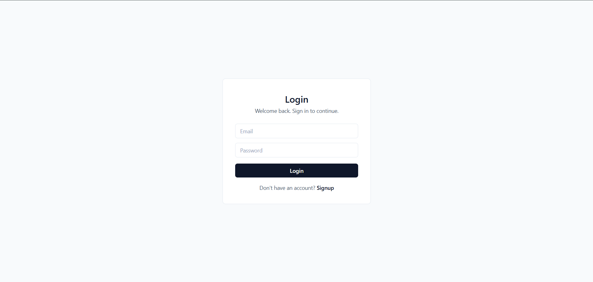
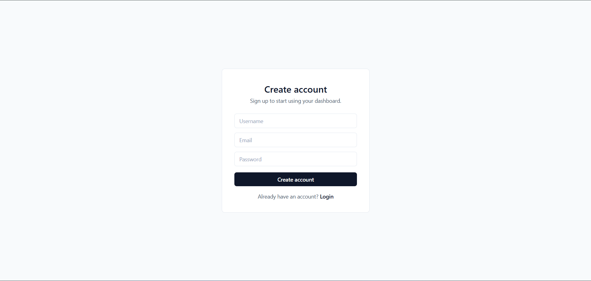
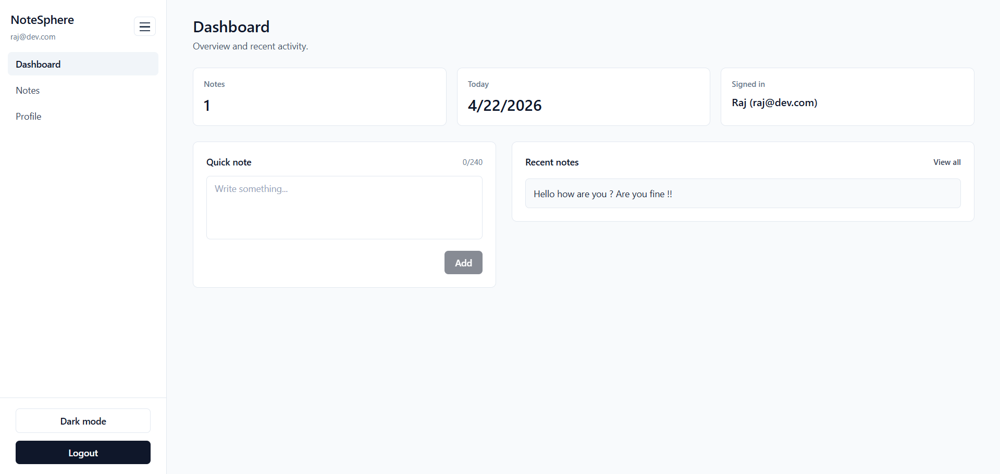

# 🚀 NoteSphere

A production-ready full-stack Notes SaaS application featuring secure JWT authentication, user-specific data management, and a modern dashboard UI built with React, Node.js, Express, and MongoDB.

---

## ✨ Features

* 🔐 Secure Authentication (JWT + bcrypt)
* 📝 Full Notes Management (Create, Edit, Delete)
* 🌙 Dark / Light Mode Toggle
* 📊 Dashboard UI (SaaS-style layout)
* 👤 User Profile Page
* 🔒 Protected Routes
* 🌐 Full Backend Integration (MongoDB)
* 📱 Fully Responsive Design (Mobile + Desktop)
* ⚡ Fast UI with Tailwind CSS

---

## 🌐 Live Demo

| Platform       | Link                                  |
| -------------- | ------------------------------------- |
| 🚀 Frontend    | https://your-vercel-link.vercel.app   |
| ⚙️ Backend API | https://your-render-link.onrender.com |

---

## 📸 Application Preview

### 🔐 Login Page

### 📝 Signup Page

### 📊 Dashboard

---

## 🛠️ Tech Stack

### 🎨 Frontend

* React (Vite)
* Tailwind CSS
* Axios

### ⚙️ Backend

* Node.js
* Express.js
* MongoDB + Mongoose
* JWT Authentication
* bcryptjs

### ☁️ Deployment

* Vercel (Frontend)
* Render (Backend)
* MongoDB Atlas (Database)

---

## 📁 Project Structure

auth-app/
│
├── frontend/     # React app
├── backend/      # Express API

---

## ⚙️ Environment Variables

### Backend (`backend/.env`)

PORT=5000
MONGO_URI=your_mongodb_url
JWT_SECRET=your_secret_key

### Frontend (`frontend/.env`)

VITE_API_URL=http://localhost:5000/api

---

## 🚀 Run Locally

### 1️⃣ Backend

cd backend
npm install
npm start

### 2️⃣ Frontend

cd frontend
npm install
npm run dev

---

## 🔌 API Endpoints

### 🔐 Auth

POST /auth/signup
POST /auth/login

### 👤 User

GET /users/me
PUT /users/me

### 📝 Notes

GET /notes
POST /notes
DELETE /notes/:id

All protected routes require:
Authorization: Bearer <token>

---

## 🚀 Deployment Guide

### Backend (Render)

* Add environment variables
* Start command: npm start

### Frontend (Vercel)

* Add environment variable:
  VITE_API_URL=https://your-backend.onrender.com/api
* Redeploy

---

## 🔐 Security Features

* Password hashing using bcrypt
* JWT-based authentication
* Protected API routes
* Input validation

---

## 🌟 Future Improvements

- 🔔 Notifications
- 📂 Notes categorization / tags
- 🔍 Search & filter notes
- ☁️ Real-time sync (WebSockets)

---

## 📄 License

This project is licensed under the MIT License

---

## 👨‍💻 Author

**Ritik Kumar**

---

⭐ If you found this useful, don’t forget to star the repo!
